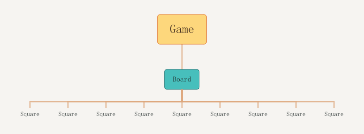

## 简介
[React 官方的新手教程](https://reactjs.org/tutorial/tutorial.html)，通过实现一个简单的[井字棋游戏](https://codepen.io/gaearon/pen/gWWZgR?editors=0010)来入门 React。

## 核心知识点
### JSX
React 中使用了一种特殊的语法（叫做 JSX）来构建视图层，例如下面 `render` 方法中 `return` 的代码片段。build 时这些 JSX 语法会被转化成 `React.createElement`。

```js
class Demo extends React.Component {
    render() {
        return (
            <div>
                <h1>Demo</h1>
            </div>
        );
    }
}
```

JSX 语法中可以用 `{}` 包裹 JS 代码。
```js
class Demo extends React.Component {
    render() {
        const demo = <h1>Demo</h1>;
        const text = "Bella";
        return (
            <div>
                {demo}
                <p>{text}</p>
            </div>
        );
    }
}
```

### 组件间的信息存储以及传递
#### 父组件传递信息给子组件
这里总共用到三种组件 `Square`，`Board`，`Game`，关系如图所示

父组件通过 `props` 向子组件传递信息，例如下面代码中父组件 `Board` 将 `value` 传递给了子组件 `Square`，传递的信息子组件需要从 `this.props` 中获取。
```js
class Square extends React.Component {
    render() {
        return (
            <div>{this.props.value}</div>
        );
    }
}

class Board extends React.Component {
    render() {
        return (
            <div>
                <Square value={1} />
                <Square value={2} />
            </div>
        );
    }
}
```

#### 组件的私有信息
除了可以通过 `props` 从外界接受信息，组件内部也可以用 `state` 存储私有信息。例如下面的代码，为组件增加一个构造函数 `constructor` 来初始化私有信息，需要注意的是第一步永远是 `super(props);`。
```js
class Demo extends React.Component {
    constructor(props) {
        super(props);
        this.state = {
            value: "previous",
        };
    }
}
```
此外修改私有信息需要调用 `this.setState`，这个方法除了修改私有信息，还会让 React 重新渲染组件。比如想要将上面代码中的 `value` 改为 "current"，这么做就行 `this.setState({value: "current"})`。

#### 子组件互相传递消息
子组件如果想使用共享的数据或传递消息，那么最好是将数据放在父组件中，由父组件进行接收和传递。

#### 子组件向父组件传递信息
父组件通过 `props` 给子组件一个函数，子组件通过该函数修改父组件中的数据。

### 使用 immutable 对象
当调用 `setState` 时，React 会重新渲染组件，如果传入的对象是 immutable，那么只要引用的对象与前一个不同，就说明改变了。而如果传入的对象是 mutable，那么需要从整个对象树中找出先前的复制品，再进行比较。
下面代码假设了组件的 `state` 中有一个数组 `array` 和一个对象 `player`，分别使用 immutable 的方式修改 `state`。
```js
const copied_array = this.state.array.slice();
copied_array[0] = 1;
this.setState({array: copied_array});

const copied_player = Object.assign({}, this.state.player);
copied_player.score = 2;
this.setState({player: copied_player});
```

### 函数式组件
其实就是把类中的 `render` 函数变成组件，参数就是 `props`。不过我懒得用函数式组件了，感觉没啥必要吧，还得多记东西。

### Key
在渲染列表时，React 会根据 `key` 来判断如何操作，比如新列表出现了一个旧列表中没有的 key，React 就会新增该组件。这意味着在生成组件后组件的 key 不应该被改变，常用的就是数据库中的 id。
如果不主动提供 key，那么 React 会给一个 `warning`，然后将 idx 作为 key，如果你主动将 idx 设为 key，虽然能屏蔽掉 `warning` 但实际的问题还在。用 idx 当 key 的问题是，当你进行例如排序，插入，删除等操作时，组件的 key 随着 idx 发生了改变。虽然有些情况可以用 idx，比如你只往数组末尾进行插入和删除操作时，不会影响到已有组件的 key，但通常有其他的最好用其他的。
